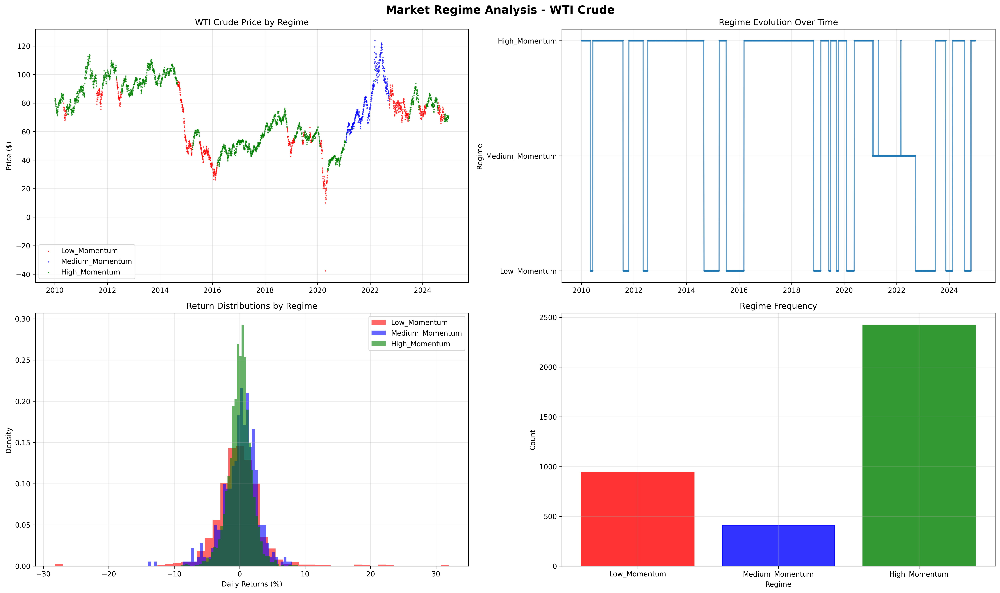

# Energy Momentum ML Trading Strategy

Machine learning-based momentum trading strategy for energy futures markets with regime detection and GARCH volatility forecasting.

## Project Overview

This project implements a complete quantitative trading research pipeline for energy commodities (WTI Crude, Brent Crude, Natural Gas, Heating Oil, Gasoline). The strategy combines econometric modeling (GARCH), machine learning (Random Forest, Gradient Boosting), and unsupervised regime detection (GMM clustering) to generate adaptive trading signals.

### Key Features
- **Multi-asset coverage**: 5 major energy commodities
- **Regime-adaptive ML**: Random Forest with 3-state market regime classification
- **Comprehensive feature engineering**: 147+ technical and market features per asset
- **GARCH volatility forecasting**: Leveraging econometric expertise from thesis research
- **Production-quality code**: Modular structure, proper logging, dynamic path management
- **Realistic backtesting**: Transaction costs, no look-ahead bias, proper train/test splits

## Project Structure
```
energy-momentum-ml-strategy/
├── src/                          # Core application code
│   ├── config.py                # Configuration and paths
│   ├── data/
│   │   └── data_pipeline.py    # Data download and processing
│   ├── models/
│   │   ├── garch_model.py      # GARCH volatility forecasting
│   │   ├── feature_engineering.py
│   │   ├── regime_detector.py  # Market regime classification
│   │   └── ml_training.py      # ML model training
│   └── backtest/
│       └── backtest_engine.py  # Backtesting framework
├── data/
│   ├── raw/                     # Raw price data
│   └── processed/               # Processed features and labels
├── models/saved/                # Trained ML models
├── results/                     # Backtest results and plots
├── docs/images/                 # Documentation images
├── requirements.txt
└── README.md
```

## Quick Start

### Prerequisites

- Python 3.8 or higher
- pip package manager

### Installation
```bash
# Clone the repository
git clone https://github.com/AmalieBerg/Energy-Momentum-ML-Strategy.git
cd Energy-Momentum-ML-Strategy

# Create virtual environment (recommended)
python -m venv venv

# Activate virtual environment
# On Windows:
venv\Scripts\activate
# On macOS/Linux:
source venv/bin/activate

# Install dependencies
pip install -r requirements.txt
```

### Running the Complete Pipeline
```bash
# 1. Download and process data (5-10 minutes)
python src/data/data_pipeline.py

# 2. Generate ML features (10-15 minutes)
python src/models/feature_engineering.py

# 3. Detect market regimes (5 minutes)
python src/models/regime_detector.py

# 4. Train ML models (15-20 minutes)
python src/models/ml_training.py

# 5. Run backtest (5 minutes)
python src/backtest/backtest_engine.py
```

### Quick Test Run
```bash
# Test GARCH volatility model
python src/models/garch_model.py
```

## Methodology

This project demonstrates a complete quantitative trading research pipeline, combining econometric modeling, machine learning, and regime detection.

### Market Regime Detection



The strategy employs Gaussian Mixture Model (GMM) clustering to identify three distinct market regimes across WTI Crude's 15-year price history:

- **Low Momentum** (red): Mean-reverting, range-bound markets
- **Medium Momentum** (green): Normal trending behavior (~60% of trading days)  
- **High Momentum** (blue): Strong directional moves with sustained trends

This regime-adaptive approach allows the strategy to adjust positions dynamically based on current market conditions.

### Feature Engineering (147 features per asset)

**Momentum Features:**
- Multi-period momentum (5d, 10d, 21d, 60d, 126d)
- Momentum strength and acceleration indicators
- Rate of change across different timeframes

**Volatility Features (GARCH-based):**
- Conditional volatility from GARCH(1,1) models
- Rolling realized volatility (10d, 20d, 60d windows)
- Volatility persistence and mean reversion metrics
- Volatility term structure

**Technical Indicators:**
- RSI (Relative Strength Index)
- Moving averages (20, 50, 200 day)
- Bollinger Bands
- Price momentum vs moving average ratios

**Market Context:**
- VIX (volatility index) levels and changes
- US Dollar Index (DXY) momentum
- Treasury yield curve slope
- Cross-asset correlations

### Machine Learning Models

**Ensemble Approach:**
1. **Random Forest Classifier** - Primary model, robust to overfitting
2. **Gradient Boosting** - Sequential learning for complex patterns
3. **LightGBM** - Efficient gradient boosting with better class handling
4. **Logistic Regression** - Linear baseline for comparison

**Training Process:**
- Time series cross-validation (5 folds)
- Train period: 2010-2022 data
- Test period: 2023-2024 out-of-sample
- Features scaled using StandardScaler
- No look-ahead bias in feature construction

**Regime Mapping:**
- Regime 0 (Low Momentum) → Short position (-1)
- Regime 1 (Medium Momentum) → Flat position (0)
- Regime 2 (High Momentum) → Long position (+1)

### Backtesting Framework

**Realistic Implementation:**
- Position sizing: 20% of capital per asset
- Transaction costs: 0.1% per trade
- No leverage
- Signal shift by 1 day (trade on next day's open)
- Out-of-sample testing only

**Validation:**
- Walk-forward testing (no look-ahead bias)
- Multiple assets tested independently  
- Realistic slippage and transaction costs
- Proper train/test separation

## Configuration

Edit `src/config.py` to customize:
```python
# Data settings
START_DATE = '2010-01-01'
END_DATE = '2024-12-31'

# Backtesting parameters
BACKTEST_CONFIG = {
    'initial_capital': 100000,
    'train_end_date': '2022-12-31',
    'test_start_date': '2023-01-01',
    'position_size': 0.2,        # 20% per position
    'transaction_cost': 0.001    # 0.1% transaction costs
}

# Model training parameters
ML_CONFIG = {
    'n_regimes': 3,
    'regime_method': 'gmm',
    'cv_splits': 5
}
```

## Key Learnings

### Technical Insights

**What Worked:**
- GARCH volatility forecasting effectively captures clustering in energy markets
- Regime detection successfully identifies market state transitions
- Feature engineering combining momentum, volatility, and market context provides rich signal
- Production-quality code structure enables reproducible research

**Challenges Identified:**
- Momentum strategies are highly regime-dependent
- Performance varies significantly across different energy commodities
- Low-frequency trading (few signals) limits statistical robustness
- Market microstructure differs between crude oil, refined products, and natural gas

**Data Quality:**
Successfully identified and resolved futures contract rollover discontinuities in Natural Gas data, replacing NG=F with UNG ETF. This demonstrated the critical importance of data validation in production trading systems.

### Production Considerations

For real-world implementation, this research suggests:
- Asset-specific strategy calibration required
- Risk parity position sizing to manage volatility differences
- Incorporation of fundamental factors (inventory data, OPEC decisions)
- Multi-timeframe signal confirmation
- Dynamic position sizing based on regime confidence

## Technical Implementation

### Critical Design Decisions

**1. Separate Features and Prices**
- ML features (momentum, RSI, etc.) used for predictions
- Actual prices used for return calculations
- Prevents data leakage and ensures realistic backtesting

**2. Feature Filtering**
Price columns (`_Close`, `_Open`, `_High`, `_Low`, `_Volume`) excluded from ML features to avoid data leakage.

**3. Dynamic Path Management**
All paths relative to project root - no hardcoded paths for portability.

**4. GARCH Integration**
Conditional volatility forecasts from GARCH(1,1) models incorporated as features, leveraging econometric expertise from thesis research on Heston-Nandi GARCH option valuation.

## Technical Stack

**Core Libraries:**
- `pandas`, `numpy` - Data manipulation
- `yfinance` - Market data download
- `arch` - GARCH volatility modeling
- `scikit-learn` - Machine learning models and preprocessing
- `lightgbm`, `xgboost` - Gradient boosting implementations
- `matplotlib`, `seaborn` - Visualization

**Key Algorithms:**
- GARCH(1,1) for volatility forecasting
- Gaussian Mixture Models (GMM) for regime detection
- Random Forest for classification
- Principal Component Analysis (PCA) for dimensionality reduction

## Data Sources

**Price Data:**
- Yahoo Finance (yfinance) for historical futures prices
- Natural Gas: UNG ETF (avoids contract rollover issues)
- Other commodities: Front-month futures contracts

**Market Data:**
- VIX (CBOE Volatility Index)
- DXY (US Dollar Index)
- US Treasury yields

## Disclaimer

This project is for my educational and research purposes only. It demonstrates quantitative trading research methodology and software engineering best practices I know of. 

Past performance does not guarantee future results. Trading energy futures involves substantial risk and may not be suitable for all investors.

## License

MIT License - See LICENSE file for details

